```mermaid
graph TB
    %% Actores
    subgraph Actores
        H[👤 Jugador Humano]
        AI[🤖 Inteligencia Artificial]
        S[🖥️ Servidor de Juegos]
    end
    
    %% Sistema principal
    subgraph "Sistema de Juegos Cliente-Servidor"
        %% Casos de uso de conexión
        subgraph "Gestión de Conexión"
            UC01[Conectar al Servidor]
            UC02[Desconectarse]
            UC03[Configurar Servidor]
        end
        
        %% Casos de uso de selección
        subgraph "Selección de Juego"
            UC04[Seleccionar Juego]
            UC05[Configurar Modo]
            UC06[Unirse a Sala]
        end
        
        %% Casos de uso de Tic-Tac-Toe
        subgraph "🎯 Tic-Tac-Toe"
            UC07[Realizar Movimiento TTT]
            UC08[Calcular Mejor Jugada TTT]
            UC09[Validar Victoria TTT]
            UC10[Mostrar Tablero TTT]
        end
        
        %% Casos de uso de Batalla Naval
        subgraph "⚓ Batalla Naval"
            UC11[Configurar Barcos]
            UC12[Realizar Disparo]
            UC13[Procesar Impacto]
            UC14[Calcular Estrategia Naval]
            UC15[Validar Victoria Naval]
            UC16[Mostrar Tableros]
        end
        
        %% Casos de uso del servidor
        subgraph "🔧 Gestión del Servidor"
            UC17[Gestionar Conexiones]
            UC18[Crear Salas de Juego]
            UC19[Sincronizar Estado]
            UC20[Difundir Mensajes]
            UC21[Manejar Desconexiones]
        end
    end
    
    %% Relaciones Actor-Caso de Uso
    
    %% Jugador Humano
    H --> UC01
    H --> UC02
    H --> UC03
    H --> UC04
    H --> UC05
    H --> UC07
    H --> UC11
    H --> UC12
    
    %% Inteligencia Artificial
    AI --> UC08
    AI --> UC14
    
    %% Servidor
    S --> UC17
    S --> UC18
    S --> UC19
    S --> UC20
    S --> UC21
    
    %% Relaciones include/extend
    UC01 -.->|include| UC17
    UC04 -.->|include| UC18
    UC07 -.->|include| UC09
    UC12 -.->|include| UC13
    UC13 -.->|include| UC15
    UC08 -.->|extend| UC07
    UC14 -.->|extend| UC12
    UC05 -.->|extend| UC04
    UC06 -.->|include| UC18
    UC10 -.->|include| UC19
    UC16 -.->|include| UC19
    
    %% Estilos
    classDef actor fill:#e1f5fe,stroke:#01579b,stroke-width:2px
    classDef usecase fill:#e8f5e8,stroke:#2e7d32,stroke-width:2px
    classDef tictactoe fill:#fff3e0,stroke:#ef6c00,stroke-width:2px
    classDef battleship fill:#f3e5f5,stroke:#7b1fa2,stroke-width:2px
    classDef server fill:#ffebee,stroke:#c62828,stroke-width:2px
    
    class H,AI,S actor
    class UC01,UC02,UC03,UC04,UC05,UC06 usecase
    class UC07,UC08,UC09,UC10 tictactoe
    class UC11,UC12,UC13,UC14,UC15,UC16 battleship
    class UC17,UC18,UC19,UC20,UC21 server
```

# Diagrama de Casos de Uso - Sistema de Juegos Cliente-Servidor

## 📋 Descripción de Casos de Uso Principales

### 🔗 **Gestión de Conexión**
- **UC01 - Conectar al Servidor**: El jugador establece conexión TCP con el servidor
- **UC02 - Desconectarse**: Terminar la conexión de forma limpia
- **UC03 - Configurar Servidor**: Especificar dirección IP y puerto del servidor

### 🎮 **Selección de Juego**
- **UC04 - Seleccionar Juego**: Elegir entre Tic-Tac-Toe o Batalla Naval
- **UC05 - Configurar Modo**: Decidir entre vs Humano o vs IA
- **UC06 - Unirse a Sala**: Participar en una sala de juego existente

### 🎯 **Tic-Tac-Toe**
- **UC07 - Realizar Movimiento**: Colocar símbolo en una celda del tablero
- **UC08 - Calcular Mejor Jugada**: IA usa algoritmo Minimax para decidir
- **UC09 - Validar Victoria**: Verificar condiciones de victoria (3 en línea)
- **UC10 - Mostrar Tablero**: Actualizar interfaz gráfica del tablero

### ⚓ **Batalla Naval**
- **UC11 - Configurar Barcos**: Colocar flota en el tablero (automático o manual)
- **UC12 - Realizar Disparo**: Atacar coordenada en tablero enemigo
- **UC13 - Procesar Impacto**: Determinar si es agua, impacto o hundimiento
- **UC14 - Calcular Estrategia**: IA usa estrategias Hunt & Target
- **UC15 - Validar Victoria**: Verificar si todos los barcos están hundidos
- **UC16 - Mostrar Tableros**: Actualizar vista del tablero propio y enemigo

### 🔧 **Gestión del Servidor**
- **UC17 - Gestionar Conexiones**: Aceptar y manejar múltiples clientes
- **UC18 - Crear Salas**: Establecer salas de juego para cada partida
- **UC19 - Sincronizar Estado**: Mantener coherencia entre clientes
- **UC20 - Difundir Mensajes**: Enviar actualizaciones a todos los participantes
- **UC21 - Manejar Desconexiones**: Gestionar salidas inesperadas de clientes

## 🔄 **Relaciones entre Casos de Uso**

### Include (Dependencias)
- Conectar al Servidor **incluye** Gestionar Conexiones
- Seleccionar Juego **incluye** Crear Salas de Juego
- Realizar Movimiento **incluye** Validar Victoria
- Realizar Disparo **incluye** Procesar Impacto

### Extend (Extensiones)
- Calcular Mejor Jugada **extiende** Realizar Movimiento (modo vs IA)
- Calcular Estrategia **extiende** Realizar Disparo (modo vs IA)
- Configurar Modo **extiende** Seleccionar Juego (configuración avanzada)
