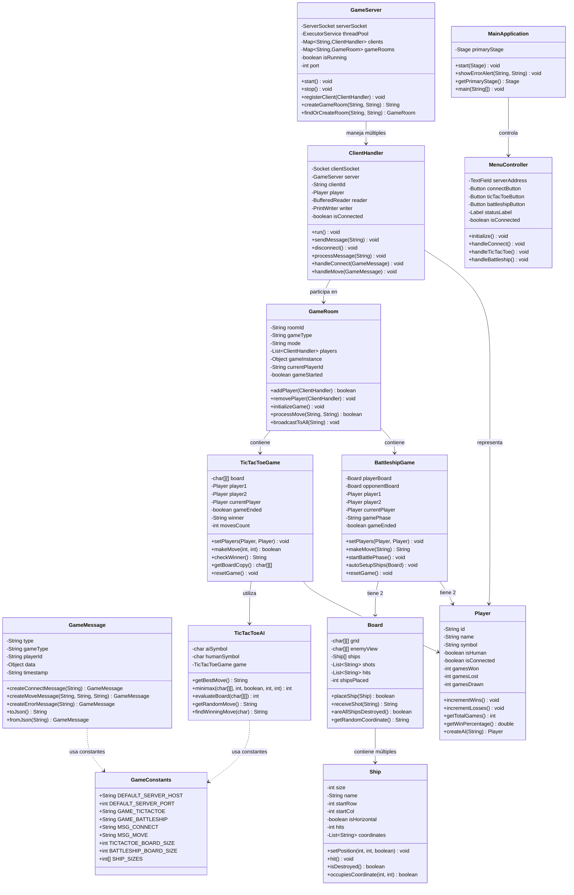

```mermaid
classDiagram
    %% Diagrama de Clases - Sistema de Juegos Cliente-Servidor
    
    class MainApplication {
        -Stage primaryStage
        +start(Stage) void
        +showErrorAlert(String, String) void
        +getPrimaryStage() Stage
        +main(String[]) void
    }
    
    class GameConstants {
        +String DEFAULT_SERVER_HOST
        +int DEFAULT_SERVER_PORT
        +String GAME_TICTACTOE
        +String GAME_BATTLESHIP
        +String MSG_CONNECT
        +String MSG_MOVE
        +int TICTACTOE_BOARD_SIZE
        +int BATTLESHIP_BOARD_SIZE
        +int[] SHIP_SIZES
    }
    
    class GameMessage {
        -String type
        -String gameType
        -String playerId
        -Object data
        -String timestamp
        +createConnectMessage(String) GameMessage
        +createMoveMessage(String, String, String) GameMessage
        +createErrorMessage(String) GameMessage
        +toJson() String
        +fromJson(String) GameMessage
    }
    
    class Player {
        -String id
        -String name
        -String symbol
        -boolean isHuman
        -boolean isConnected
        -int gamesWon
        -int gamesLost
        -int gamesDrawn
        +incrementWins() void
        +incrementLosses() void
        +getTotalGames() int
        +getWinPercentage() double
        +createAI(String) Player
    }
    
    class GameServer {
        -ServerSocket serverSocket
        -ExecutorService threadPool
        -Map~String,ClientHandler~ clients
        -Map~String,GameRoom~ gameRooms
        -boolean isRunning
        -int port
        +start() void
        +stop() void
        +registerClient(ClientHandler) void
        +createGameRoom(String, String) String
        +findOrCreateRoom(String, String) GameRoom
    }
    
    class ClientHandler {
        -Socket clientSocket
        -GameServer server
        -String clientId
        -Player player
        -BufferedReader reader
        -PrintWriter writer
        -boolean isConnected
        +run() void
        +sendMessage(String) void
        +disconnect() void
        +processMessage(String) void
        +handleConnect(GameMessage) void
        +handleMove(GameMessage) void
    }
    
    class GameRoom {
        -String roomId
        -String gameType
        -String mode
        -List~ClientHandler~ players
        -Object gameInstance
        -String currentPlayerId
        -boolean gameStarted
        +addPlayer(ClientHandler) boolean
        +removePlayer(ClientHandler) void
        +initializeGame() void
        +processMove(String, String) boolean
        +broadcastToAll(String) void
    }
    
    class TicTacToeGame {
        -char[][] board
        -Player player1
        -Player player2
        -Player currentPlayer
        -boolean gameEnded
        -String winner
        -int movesCount
        +setPlayers(Player, Player) void
        +makeMove(int, int) boolean
        +checkWinner() String
        +getBoardCopy() char[][]
        +resetGame() void
    }
    
    class TicTacToeAI {
        -char aiSymbol
        -char humanSymbol
        -TicTacToeGame game
        +getBestMove() String
        +minimax(char[][], int, boolean, int, int) int
        +evaluateBoard(char[][]) int
        +getRandomMove() String
        +findWinningMove(char) String
    }
    
    class BattleshipGame {
        -Board playerBoard
        -Board opponentBoard
        -Player player1
        -Player player2
        -Player currentPlayer
        -String gamePhase
        -boolean gameEnded
        +setPlayers(Player, Player) void
        +makeMove(String) String
        +startBattlePhase() void
        +autoSetupShips(Board) void
        +resetGame() void
    }
    
    class Board {
        -char[][] grid
        -char[][] enemyView
        -Ship[] ships
        -List~String~ shots
        -List~String~ hits
        -int shipsPlaced
        +placeShip(Ship) boolean
        +receiveShot(String) String
        +areAllShipsDestroyed() boolean
        +getRandomCoordinate() String
    }
    
    class Ship {
        -int size
        -String name
        -int startRow
        -int startCol
        -boolean isHorizontal
        -int hits
        -List~String~ coordinates
        +setPosition(int, int, boolean) void
        +hit() void
        +isDestroyed() boolean
        +occupiesCoordinate(int, int) boolean
    }
    
    class MenuController {
        -TextField serverAddress
        -Button connectButton
        -Button ticTacToeButton
        -Button battleshipButton
        -Label statusLabel
        -boolean isConnected
        +initialize() void
        +handleConnect() void
        +handleTicTacToe() void
        +handleBattleship() void
    }
    
    %% Relaciones
    MainApplication --> MenuController : controla
    GameServer --> ClientHandler : maneja múltiples
    ClientHandler --> GameRoom : participa en
    GameRoom --> TicTacToeGame : contiene
    GameRoom --> BattleshipGame : contiene
    TicTacToeGame --> TicTacToeAI : utiliza
    TicTacToeGame --> Player : tiene 2
    BattleshipGame --> Board : tiene 2
    BattleshipGame --> Player : tiene 2
    Board --> Ship : contiene múltiples
    ClientHandler --> Player : representa
    GameMessage ..> GameConstants : usa constantes
    TicTacToeAI ..> GameConstants : usa constantes
```
