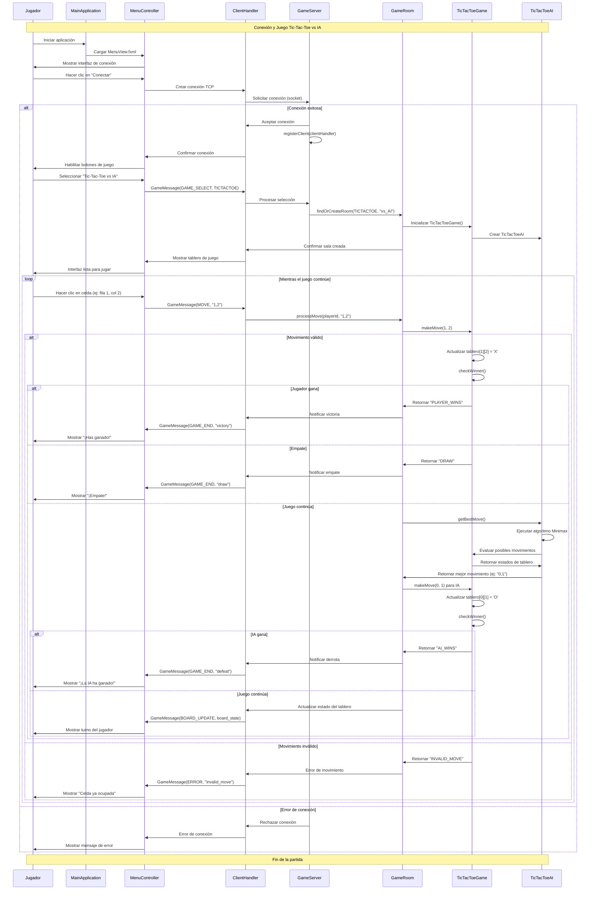

```mermaid
sequenceDiagram
    participant J as Jugador
    participant M as MainApplication
    participant MC as MenuController
    participant CH as ClientHandler
    participant GS as GameServer
    participant GR as GameRoom
    participant TTT as TicTacToeGame
    participant AI as TicTacToeAI

    Note over J,AI: Conexión y Juego Tic-Tac-Toe vs IA

    %% Fase de Conexión
    J->>M: Iniciar aplicación
    M->>MC: Cargar MenuView.fxml
    MC->>J: Mostrar interfaz de conexión
    
    J->>MC: Hacer clic en "Conectar"
    MC->>CH: Crear conexión TCP
    CH->>GS: Solicitar conexión (socket)
    
    alt Conexión exitosa
        GS->>CH: Aceptar conexión
        GS->>GS: registerClient(clientHandler)
        CH->>MC: Confirmar conexión
        MC->>J: Habilitar botones de juego
        
        %% Selección de juego
        J->>MC: Seleccionar "Tic-Tac-Toe vs IA"
        MC->>CH: GameMessage(GAME_SELECT, TICTACTOE)
        CH->>GS: Procesar selección
        GS->>GR: findOrCreateRoom(TICTACTOE, "vs_AI")
        GR->>TTT: Inicializar TicTacToeGame()
        TTT->>AI: Crear TicTacToeAI
        GR->>CH: Confirmar sala creada
        CH->>MC: Mostrar tablero de juego
        MC->>J: Interfaz lista para jugar
        
        %% Bucle de juego
        loop Mientras el juego continúe
            J->>MC: Hacer clic en celda (ej: fila 1, col 2)
            MC->>CH: GameMessage(MOVE, "1,2")
            CH->>GR: processMove(playerId, "1,2")
            GR->>TTT: makeMove(1, 2)
            
            alt Movimiento válido
                TTT->>TTT: Actualizar tablero[1][2] = 'X'
                TTT->>TTT: checkWinner()
                
                alt Jugador gana
                    TTT->>GR: Retornar "PLAYER_WINS"
                    GR->>CH: Notificar victoria
                    CH->>MC: GameMessage(GAME_END, "victory")
                    MC->>J: Mostrar "¡Has ganado!"
                else Empate
                    TTT->>GR: Retornar "DRAW"
                    GR->>CH: Notificar empate
                    CH->>MC: GameMessage(GAME_END, "draw")
                    MC->>J: Mostrar "¡Empate!"
                else Juego continúa
                    GR->>AI: getBestMove()
                    AI->>AI: Ejecutar algoritmo Minimax
                    AI->>TTT: Evaluar posibles movimientos
                    TTT->>AI: Retornar estados de tablero
                    AI->>GR: Retornar mejor movimiento (ej: "0,1")
                    GR->>TTT: makeMove(0, 1) para IA
                    TTT->>TTT: Actualizar tablero[0][1] = 'O'
                    TTT->>TTT: checkWinner()
                    
                    alt IA gana
                        TTT->>GR: Retornar "AI_WINS"
                        GR->>CH: Notificar derrota
                        CH->>MC: GameMessage(GAME_END, "defeat")
                        MC->>J: Mostrar "¡La IA ha ganado!"
                    else Juego continúa
                        GR->>CH: Actualizar estado del tablero
                        CH->>MC: GameMessage(BOARD_UPDATE, board_state)
                        MC->>J: Mostrar turno del jugador
                    end
                end
            else Movimiento inválido
                TTT->>GR: Retornar "INVALID_MOVE"
                GR->>CH: Error de movimiento
                CH->>MC: GameMessage(ERROR, "invalid_move")
                MC->>J: Mostrar "Celda ya ocupada"
            end
        end
        
    else Error de conexión
        GS->>CH: Rechazar conexión
        CH->>MC: Error de conexión
        MC->>J: Mostrar mensaje de error
    end

    Note over J,AI: Fin de la partida
```
